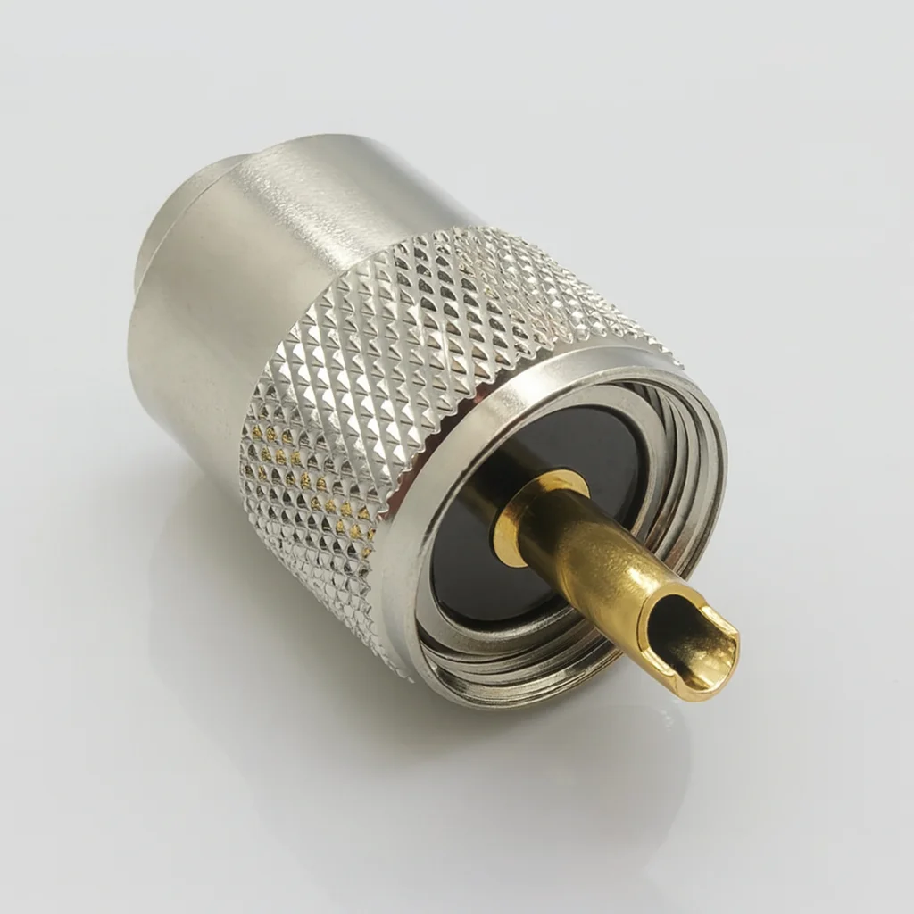
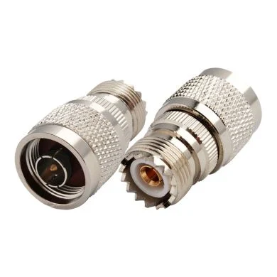
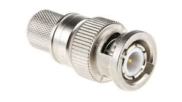
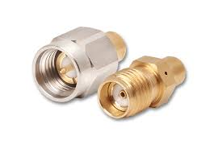
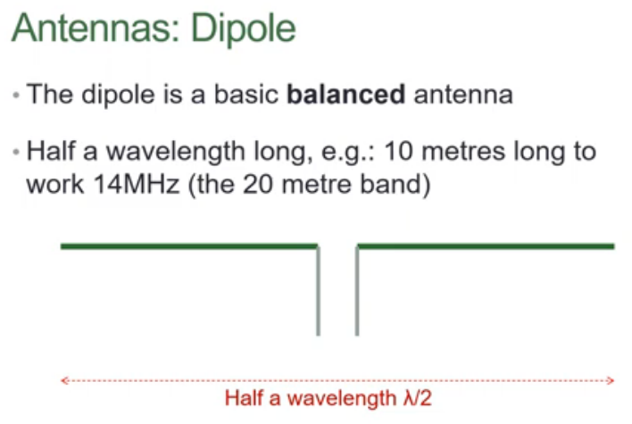
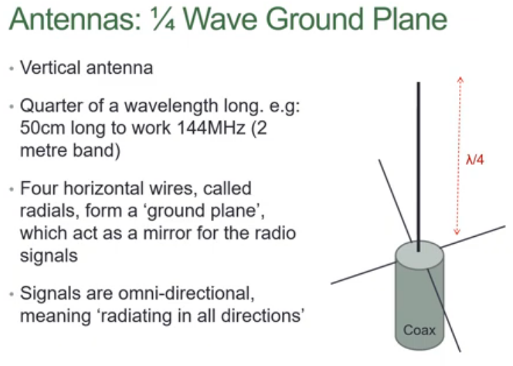
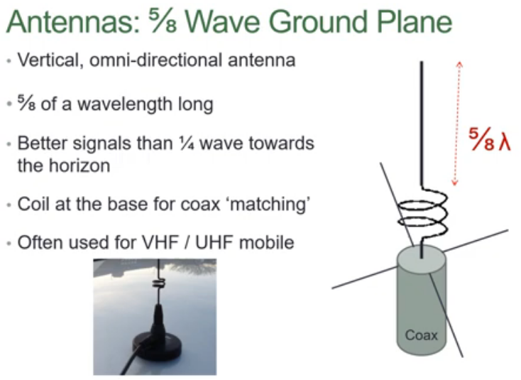
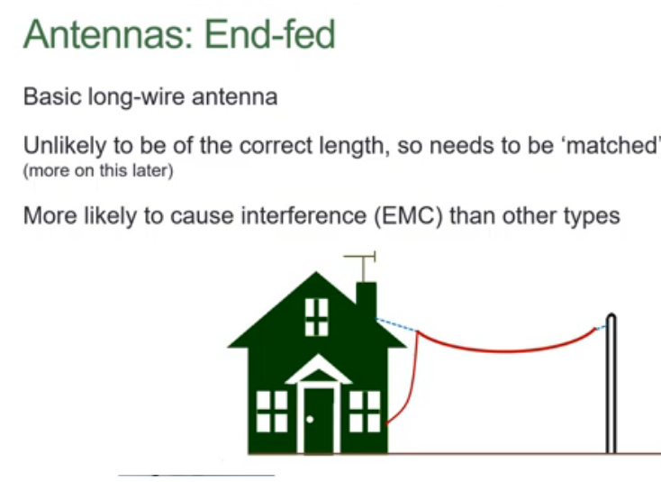
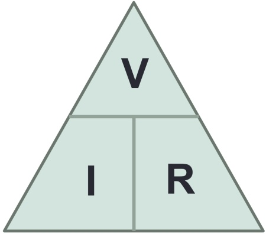
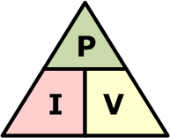

# Foundation Licence Exam Preparation Notes

These are my notes to help prepare for the Foundation Licence exam in the UK.

## Common RF Connector Types

### PL-259 (UHF Connector)

The PL-259 is a common RF connector used for HF and VHF amateur radio equipment. It is robust and easy to fit, but not ideal for higher frequencies due to its design.

### N-Type Connector

The N-type connector is designed for use at higher frequencies (up to several GHz). It provides a weatherproof, threaded connection and is often used for professional and high-power applications.

### BNC Connector

The BNC connector is a quick-connect/disconnect RF connector used for low-power and test equipment. It is popular for handheld radios and laboratory instruments.

### SMA Connector

The SMA connector is a small, threaded RF connector commonly used on handheld radios, antennas, and Wi-Fi equipment. It is suitable for high-frequency applications and provides a secure connection.

## Common Types of Antennas

### 1. Dipole Antenna

A dipole antenna consists of two equal-length conductors in a straight line. It is typically half a wavelength (λ/2) long and is one of the most common and efficient antenna types.

### 2. 1/4 Wave Ground Plane Antenna

This antenna uses a vertical element that is a quarter wavelength (λ/4) long, with several radials (wires) acting as a ground plane. It is often used for VHF and UHF communications.

### 3. 5/8 Wave Ground Plane Antenna

The 5/8 wave ground plane antenna has a vertical element that is five-eighths of a wavelength (5λ/8) long. It provides more gain and a lower angle of radiation compared to the 1/4 wave version.

### 4. End Fed Long Wire Antenna

An end-fed long wire antenna is a single wire, usually at least one wavelength (λ) long, fed from one end. It is simple to install and can be used for a wide range of frequencies.

## Ohm's Law (VIR Triangle)

The image above shows the Ohm's Law triangle, also known as the VIR triangle. It is a helpful visual tool for remembering the relationship between Voltage (V), Current (I), and Resistance (R):

- V (Voltage) is at the top of the triangle.
- I (Current) and R (Resistance) are at the bottom corners.

To use the triangle:
- Cover the value you want to find.
- The remaining two values show the operation:
	- If side by side (I and R), multiply: V = I × R
	- If one above the other (V over I or R), divide: I = V ÷ R or R = V ÷ I

## Power Law (PIV Triangle)

The image above shows the Power triangle (PIV triangle), which helps you remember the relationship between Power (P, measured in watts), Current (I, measured in amperes), and Voltage (V, measured in volts):

- P (Power) is at the top of the triangle.
- I (Current) and V (Voltage) are at the bottom corners.

To use the triangle:
- Cover the value you want to find.
- The remaining two values show the operation:
	- If side by side (I and V), multiply: P = I × V
	- If one above the other (P over I or V), divide: I = P ÷ V or V = P ÷ I

## Key Concepts and Terminology

The higher the frequency, the shorter the wavelength.

### Wavelength Reference

| Frequency | Wavelength |
|-----------|------------|
| 14 MHz    | 20 metres  |
| 144 MHz   | 2 metres   |

### Frequency Band Summary

| Band | Abbreviation       | Range          |
|------|--------------------|----------------|
| HF   | High Frequency     | 3–30 MHz       |
| VHF  | Very High Frequency| 30–300 MHz     |
| UHF  | Ultra High Frequency| 300–3000 MHz  |

**Human hearing range:** 20 Hz to 15 kHz

### Key Terms

| Term       | Definition                                                                    |
|------------|-------------------------------------------------------------------------------|
| Dipole     | A straight antenna, typically half a wavelength long                          |
| Yagi       | A directional antenna; multiply the gain factor to calculate effective power  |
| ERP        | Effective Radiated Power — the power transmitted from the antenna             |
| EIRP       | Equivalent Isotropically Radiated Power — compares a dipole to an isotropic radiator |
| Balun      | Used to balance a dipole antenna                                               |
| ATU        | Antenna Tuning Unit — used for impedance matching between antenna and transmitter |
| Ionosphere | Layer of the atmosphere 70–400 km above the Earth, used to reflect HF signals |

## Licence Conditions

### Call Sign Prefixes

| Prefix | Licence Level        |
|--------|----------------------|
| M7     | Foundation Licence   |
| M6     | Intermediate Licence |
| M0     | Full Licence         |

Country abbreviations are used in call signs to indicate the country of operation.

### Regional Secondary Locators

Inserted after the initial letter to indicate location:

| Locator | Region           |
|---------|------------------|
| E       | England          |
| W       | Wales            |
| S       | Scotland         |
| I       | Northern Ireland |
| D       | Isle of Man      |
| J       | Jersey           |
| U       | Guernsey         |

For example, `M7EABC` would indicate England, while `M7WABC` would indicate Wales.

### Locator Suffixes

| Suffix | Usage                              |
|--------|------------------------------------|
| /m     | Mobile operation                   |
| /a     | Alternative address                |
| /p     | Portable operation / field event   |
| /mm    | Maritime mobile (at sea)           |

:::caution
Signals greater than 10 watts EIRP (e.g., 6.1 watts ERP) may require an EMF assessment for public safety.
:::

### Technical Notes

- A **detector** removes the carrier signal from a received transmission.
- An **antenna** converts electrical signals into radio waves, and vice versa.
- **VHF/UHF** antennas are typically limited to line-of-sight range.
- **End-fed wire antennas** are most commonly associated with interference issues.
- For interference advice, refer to the [RSGB EMC Committee](https://rsgb.org/main/technical/emc/) website.
- Ensure the correct **PTT (Push-To-Talk)** connection is used for computer-based transmissions.

When changing frequency bands, you must always transmit your call sign. This ensures that your identity is clear to other operators and is a legal requirement.

You should also transmit your call sign:
- At the start and end of each contact
- At least every 15 minutes during a conversation
- When changing operating mode or location

Transmitting messages:
- General transmissions are for making contact with other stations.
- "CQ" is a general call to any station listening and is used when you want to start a contact with anyone.
- Nets are organized group contacts, often with a net controller. When joining a net, listen for the controller and follow their instructions. Always give your call sign when checking in or leaving a net.

Transmitting messages intended solely for general reception is not permitted, except when making CQ calls or participating in nets.

The ionosphere is used to reflect HF (high frequency) radio signals back to the Earth's surface, allowing long-distance communication.

Snow and ice can reduce the range of UHF signals.

### Identifying Your Station

To correctly identify your station in accordance with your licence, you **must** state the call sign of the station you are in contact with, followed by your own call sign.

## Transmitting Rules

Except for making a CQ call, the amateur radio licence does not permit transmitting to anyone who simply happens to be listening. All transmissions must be directed at a specific, identified station — you cannot broadcast messages for general reception.

When an audio frequency (AF) is mixed with a radio frequency (RF) carrier through a non-linear process, the result is **sidebands** — frequencies above and below the carrier that carry the audio information.

## Frequency Bands

The following bands are commonly tested in the Foundation exam:

| Band | Frequency Range | Example Band        | Description          |
|------|-----------------|---------------------|----------------------|
| HF   | 3–30 MHz        | 40m (7 MHz)         | High Frequency       |
| VHF  | 30–300 MHz      | 2m (144–146 MHz)    | Very High Frequency  |
| UHF  | 300–3000 MHz    | 70cm (430 MHz)      | Ultra High Frequency |

:::tip
**ERP** (Effective Radiated Power) references the antenna against an ideal isotropic radiator — one that radiates equally in all directions.
:::

---

## Practice Exam Questions

Test yourself on the topics covered in these notes. Answers are provided at the bottom.

### RF Connectors

**Q1.** Which RF connector is commonly used for HF and VHF equipment and is known for being robust and easy to fit?
- A) BNC
- B) SMA
- C) PL-259
- D) N-Type

**Q2.** Which connector is best suited for use up to several GHz and provides a weatherproof, threaded connection?
- A) PL-259
- B) N-Type
- C) BNC
- D) SMA

**Q3.** Which connector is typically used on handheld radios and is small with a threaded design?
- A) BNC
- B) PL-259
- C) N-Type
- D) SMA

---

### Antennas

**Q4.** How long is a standard dipole antenna?
- A) 1/4 wavelength
- B) 5/8 wavelength
- C) 1/2 wavelength
- D) 1 full wavelength

**Q5.** Which antenna type is directional and provides gain?
- A) Dipole
- B) End-fed long wire
- C) Yagi
- D) 1/4 wave ground plane

**Q6.** Which antenna type is most commonly associated with causing interference?
- A) Yagi
- B) Dipole
- C) 5/8 wave ground plane
- D) End-fed long wire

**Q7.** What is the purpose of a Balun?
- A) To tune the transmitter power output
- B) To match the antenna impedance to the feeder
- C) To balance a dipole antenna
- D) To remove the carrier signal

---

### Ohm's Law & Power

**Q8.** Using the VIR triangle, if Voltage = 12V and Resistance = 4Ω, what is the Current?
- A) 48A
- B) 0.33A
- C) 3A
- D) 8A

**Q9.** Using the PIV triangle, if Power = 100W and Voltage = 50V, what is the Current?
- A) 5000A
- B) 0.5A
- C) 2A
- D) 50A

---

### Frequencies & Wavelengths

**Q10.** What is the wavelength of a 14 MHz signal?
- A) 2 metres
- B) 40 metres
- C) 20 metres
- D) 70 centimetres

**Q11.** Which frequency range is classed as VHF?
- A) 3–30 MHz
- B) 300–3000 MHz
- C) 30–300 MHz
- D) 0.3–3 MHz

**Q12.** The 70cm band operates at approximately which frequency?
- A) 144 MHz
- B) 7 MHz
- C) 430 MHz
- D) 50 MHz

**Q13.** What is the approximate frequency of the 40m band?
- A) 144 MHz
- B) 430 MHz
- C) 7 MHz
- D) 3.5 MHz

**Q14.** What happens to wavelength as frequency increases?
- A) Wavelength increases
- B) Wavelength stays the same
- C) Wavelength decreases
- D) Wavelength doubles

---

### Licence Conditions

**Q15.** Which call sign prefix indicates a Foundation Licence holder in the UK?
- A) M0
- B) M6
- C) M3
- D) M7

**Q16.** What does the regional locator `S` indicate in a UK call sign?
- A) Suffolk
- B) Scotland
- C) Somerset
- D) Sussex

**Q17.** Which locator suffix indicates that a station is operating at sea?
- A) /p
- B) /a
- C) /mm
- D) /m

**Q18.** How often must you transmit your call sign during a long conversation?
- A) Every 5 minutes
- B) Every 30 minutes
- C) At least every 15 minutes
- D) Only at the start and end

**Q19.** When must you always transmit your call sign?
- A) When changing frequency bands
- B) When increasing power
- C) When connecting an ATU
- D) When switching antennas

---

### Transmitting Rules

**Q20.** Under the amateur Foundation licence, when is it permitted to transmit to anyone who happens to be listening?
- A) At any time
- B) Only during a net
- C) Only when making a CQ call
- D) Never

**Q21.** What is a "CQ" call used for?
- A) Calling a specific station in an emergency
- B) A general call inviting any station to respond
- C) Notifying the regulator of your operation
- D) Identifying your station at the end of a contact

**Q22.** What is produced when an audio frequency (AF) is mixed with a radio frequency (RF) carrier through a non-linear process?
- A) Noise floor
- B) Harmonics
- C) Sidebands
- D) Carrier suppression

---

### Propagation & Other

**Q23.** At what altitude above the Earth is the ionosphere found?
- A) 10–50 km
- B) 70–400 km
- C) 500–1000 km
- D) 5–20 km

**Q24.** Which type of signal propagation does the ionosphere support?
- A) UHF line-of-sight
- B) VHF satellite
- C) HF long-distance
- D) Microwave point-to-point

**Q25.** What effect can snow and ice have on UHF signals?
- A) Increase the range
- B) No effect
- C) Reduce the range
- D) Improve clarity

**Q26.** What power threshold (EIRP) may require an EMF assessment?
- A) Greater than 5 watts
- B) Greater than 25 watts
- C) Greater than 10 watts
- D) Greater than 50 watts

**Q27.** What does an ATU do?
- A) Amplifies the transmitted signal
- B) Removes interference from received signals
- C) Matches the antenna impedance to the transmitter
- D) Converts AC to DC power

---

## Answers

| Q   | Answer | Q   | Answer |
|-----|--------|-----|--------|
| Q1  | C      | Q15 | D      |
| Q2  | B      | Q16 | B      |
| Q3  | D      | Q17 | C      |
| Q4  | C      | Q18 | C      |
| Q5  | C      | Q19 | A      |
| Q6  | D      | Q20 | C      |
| Q7  | C      | Q21 | B      |
| Q8  | C      | Q22 | C      |
| Q9  | C      | Q23 | B      |
| Q10 | C      | Q24 | C      |
| Q11 | C      | Q25 | C      |
| Q12 | C      | Q26 | C      |
| Q13 | C      | Q27 | C      |
| Q14 | C      |     |        |