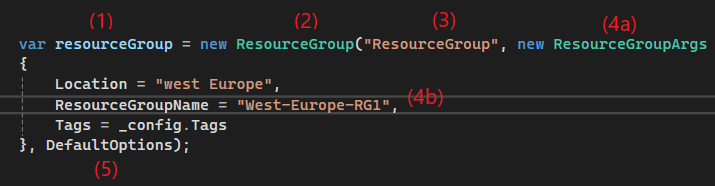

Pulumi is a type of Infrastructure as Code (IaC) tool that allows users to create infrastructure using various programming languages. This makes it more powerful than Terraform, as it leverages the logic and capabilities of programming languages.

I used Pulumi with .NET 8, which is why this website has two sections: Pulumi and C#, which is based on .NET.

Remember, it's not difficult; it's just about understanding that C# is all about creating objects. With Pulumi, we are simply creating resources by providing arguments to an object.

## Create your first resource

Below is an example of how to create a Resource Group in Pulumi.

We defined:

1. resourceGroup is a new c# object which is created with the following settings. 
2. resourceGroup is the [Pulumi Function](https://www.pulumi.com/registry/packages/azure-native/api-docs/resources/resourcegroup/) which create the resource. 

As you can see, we are creating a new object where we specify `var` implicitly. This creates an object of type `ResourceGroup` called `resourceGroup` using the `new` ResourceGroup Pulumi function, which requires several arguments to build the actual Azure resource group.

3. The name of the object referenced in the Pulumi stack must be unique.
4. To create the Azure resource, we need to provide the `location`, `ResourceGroupName`, and `Tags`. With `location`, `ResourceGroupName` you can see we have just provided text. For `Tags` can use an existing C# object that contains all the required tags.
5. Here, We provide options to Pulumi that are not directly related to the resource.. In this case, we have created a predefined object called `DefaultOptions`. You can define settings like `DeleteBeforeReplace`, which is useful if you want to rename an Azure resource. This option will delete and recreate the resource instead of trying to rename it, which is not possible for some resources. Sometimes you need to deploy resources to a different Azure subscription. You can specify this here to instruct Pulumi to deploy to another subscription. This option can be removed; just make sure the option is removed and the comma is removed, so it looks like this: `});` * Sometimes if you are using your own modules, you may have to build your own `CustomResourceOptions`
