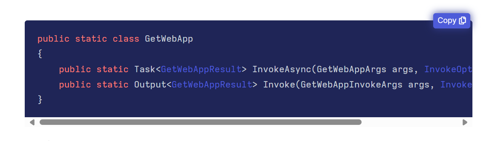

Sometimes you will need to reference existing Azure resources in Pulumi.

In my example, I need to pull in a Web App.

First of is a cool livbaey what microsfot priovied called [ResourceIdentifier](https://learn.microsoft.com/en-us/dotnet/api/azure.core.resourceidentifier?view=azure-dotnet). You provide it with the resourceID from Azure and it will provide you with details of resource:

*ResourceGroupName
*Subscritpon
*Location
*Name of Resource.

To find the Resource ID in the Azure Portal, locate and open the resource. In the top left-hand corner, click on "JSON view". A new window will appear with the Resource ID.

```csharp
var webAppDetails = new ResourceIdentifier("/subscriptions/GUID/resourceGroups/web-portal/providers/Microsoft.Web/sites/web-portal");
```
You can then use this your code:

```csharp
        var portalDetails = GetWebApp.Invoke(new GetWebAppInvokeArgs
        {
            Name = webAppDetails.Name,
            ResourceGroupName = webAppDetails.ResourceGroupName,
        });
```
In this example, we use Pulumi's `GetWebApp` method, providing the name and resource group of the web app. The output from `webAppDetails` is provided by the `ResourceIdentifier`.

Pulumi provides the `GetWebApp` method, which you can find [here](https://www.pulumi.com/registry/packages/azure-native/api-docs/web/getwebapp/). The example shown there demonstrates its usage.



In my code, we use the `GetWebApp` method to create an object/variable called `PortalDetails`. We then call `.invoke` and provide `GetWebAppInvokeArgs`, which expects the required arguments, such as the name and resource group.

Again we can then use the results in our code.
```csharp
HostName = portalDetails.DefaultHostName
```
Some time and case c# sharp cant provide the vaule, as it only know it when the code is excuted. So you have to do the following:
Again we can then use the results in our code.
```csharp
HostName = Apply(x => x.DefaultHostName),
```